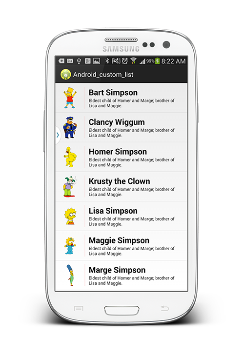
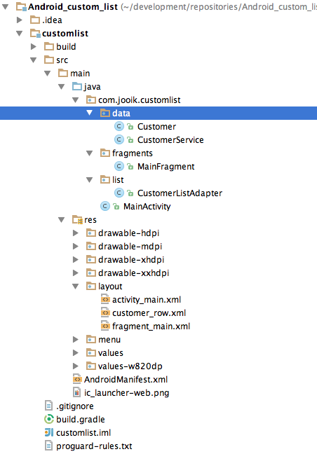

Android_custom_list
===================

A simple list (no UI eye-candy...) based on a custom domain object (for example Customer) rendering all domain object properties...



## Quick introduction

Creating a default Android list based on a String[] is pretty straightforward - but as soon as it comes to the point of rendering "sophisticated" data (for example domain objects ;)) you start googling around, scrolling through stackoverflow threads and finally ending up with something that works but having several lines in your porject you do not dare to touch as you dont wanna break your whole running project.

You could head as well for the Android Studio Template based list component (new -> list fragment) but this results in messing up your project structure as Android Studio will start generating much more than you require in order to render a simple list of domain objects. If anyone from Google developing for the Android Studio project should come across this post: pleeeeeeeease smarten up your whole template generation stuff!!!! Currently it's simply non usable...

## Develop a custom list adapter

### Domain object and corresponding service

Ok, let's finish Android Studio bashing and let's develop a nice list displayin several Simpsons characters (all images/sources etc. have been pushed to this repository).

We start with some basic stuff, somehwere in your project you should create a domain object which you aim to render and a service providing several domain objects:

```java
public class Customer
{
    // ------------------------------------------------------------------------
    // members
    // ------------------------------------------------------------------------

    private String firstname;
    private String lastname;
    private String imagepath;
    private String description;
    private int drawable;

    // ------------------------------------------------------------------------
    // constructors
    // ------------------------------------------------------------------------

    public Customer(String firstname, String lastname, String imagepath,
                    String description,int drawable)
    {
        this.firstname = firstname;
        this.lastname = lastname;
        this.imagepath = imagepath;
        this.description = description;
        this.drawable = drawable;
    }

    // ------------------------------------------------------------------------
    // GETTER & SETTER
    // ------------------------------------------------------------------------

    public String getFirstname()
    {
        return firstname;
    }

    public void setFirstname(String firstname)
    {
        this.firstname = firstname;
    }
    
    ...
    ..
    .
}
```

And a very simple Java service providing some domain objects (in this case generated statically, no DB involved):

```java
public class CustomerService
{
    public List<Customer> findAllCustomers()
    {
        List<Customer> customers = new ArrayList<Customer>();

        // Bart Simpson
        Customer customer = new Customer("Bart","Simpson",
                "https://dl.dropboxusercontent.com/u/33720504/github/Android_custom_list/simpsons/bart.png",
                "Eldest child of Homer and Marge; brother of Lisa and Maggie.",
                R.drawable.bart_transparent);
        customers.add(customer);

        // Chief Clancy Wiggum
        customer = new Customer("Clancy","Wiggum",
                "https://dl.dropboxusercontent.com/u/33720504/github/Android_custom_list/simpsons/chief_clancy_wiggum.png",
                "Springfield Chief of Police.",
                R.drawable.chief_clancy_wiggum_transparent);
        customers.add(customer);

        // Homer Simpson
        customer = new Customer("Homer","Simpson",
                "https://dl.dropboxusercontent.com/u/33720504/github/Android_custom_list/simpsons/homer.png",
                "Husband of Marge; father of Bart, Lisa, and Maggie.",
                R.drawable.homer_transparent);
        customers.add(customer);
        
        ...
        
        return customers;
    }
}
```

Ok, that's all we assume to be somewhere in your Android project, we usually create a service/data folder for this stuff, please see our dummy project structure within the screenshot below - feel free to adapt this structure or use an arbitrary structure chsoing on your own.



### Create the cell layout

A layout for the cells within your list needs to be defined. There are couple of approaches where the cell layout is created programmatically but personally creating a cell layout based on a real layout file is much more transparent and extendable in terms of splitting view and view logic so in this case we will provide a custom layout specifying the look & feel for thsi cell.

The layout for the cell is created as a regular layout file (customer_row.xml), below you can find our "image-with-two-rows-layout". Contents of this layout are totally up2you - make sure you assign IDs to the fields you plan to populate dynamically, thats all you have to do!

```xml
<?xml version="1.0" encoding="utf-8"?>
<LinearLayout
    android:orientation="vertical"
    android:layout_width="match_parent"
    android:layout_height="wrap_content"
    xmlns:android="http://schemas.android.com/apk/res/android">

    <LinearLayout xmlns:android="http://schemas.android.com/apk/res/android"
                  android:orientation="horizontal"
                  android:layout_width="match_parent"
                  android:layout_height="wrap_content">

        <ImageView
            android:padding="@dimen/default_spacing"
            android:layout_width="80dp"
            android:layout_height="80dp"
            android:id="@+id/iv_image"
            android:src="@drawable/bart_transparent"/>
        <View
              android:layout_marginTop="@dimen/default_spacing"
              android:layout_marginBottom="@dimen/default_spacing"
              android:layout_width="1dp"
              android:layout_height="fill_parent"
              android:background="#25FF0000"/>
        <LinearLayout
            android:layout_width="fill_parent"
            android:layout_height="fill_parent"
            android:orientation="vertical">
            <LinearLayout
                android:layout_width="fill_parent"
                android:layout_height="wrap_content"
                android:orientation="horizontal">
                <TextView
                    android:paddingLeft="@dimen/default_spacing"
                    android:paddingTop="@dimen/default_spacing"
                    android:id="@+id/tv_firstname"
                    android:layout_width="wrap_content"
                    android:layout_height="wrap_content"
                    android:textAppearance="?android:attr/textAppearanceLarge"
                    android:text="Bart"
                    android:textStyle="bold"
                    />
                <TextView
                    android:paddingLeft="5dp"
                    android:paddingRight="@dimen/default_spacing"
                    android:paddingTop="@dimen/default_spacing"
                    android:id="@+id/tv_lastname"
                    android:layout_width="wrap_content"
                    android:layout_height="wrap_content"
                    android:textAppearance="?android:attr/textAppearanceLarge"
                    android:text="Simpson"
                    android:textStyle="bold"
                    />
            </LinearLayout>

            <TextView
                android:paddingLeft="@dimen/default_spacing"
                android:paddingRight="@dimen/default_spacing"
                android:id="@+id/tv_description"
                android:layout_width="wrap_content"
                android:layout_height="wrap_content"
                android:textAppearance="?android:attr/textAppearanceSmall"
                android:textSize="12dp"
                android:text="Eldest child of Homer and Marge; brother of Lisa and Maggie."
                />

        </LinearLayout>

    </LinearLayout>
</LinearLayout>
```

Got it? Simply design what the cell should look like and you're done...next step is wiring your domain object "somehwo" to this layout.

### Create the list adapter

Custom ListAdapter is the magic step in order to connect your custom cell with your custom domain object. "Somehow" you need to tell the cells which field of your domain object should be referenced, that's exactly happening within the custome list adapter. Important: list adapters are designed using Java Generics - so simply pass in the type of your domain object (in our case **Customer**) and tell the adapter within the __getView()__ method how to reference your domain object properties. This is exactly the palce you need to reference your layout IDs as well in order to fetch the corresponding fields from your layout:

```java
public class CustomerListAdapter extends ArrayAdapter<Customer>
{
    private final Context context;
    private final List<Customer> customers;

    public CustomerListAdapter(Context context, int textViewResourceId, List<Customer> customers)
    {
        super(context, R.layout.customer_row, customers);
        this.context = context;
        this.customers = customers;
    }

    @Override
    public View getView(int position, View view, ViewGroup parent)
    {
        Customer customer = customers.get(position);

        LayoutInflater inflater = (LayoutInflater) context
                .getSystemService(Context.LAYOUT_INFLATER_SERVICE);
        View rowView = inflater.inflate(R.layout.customer_row, parent, false);

        TextView tvFirstname = (TextView)rowView.findViewById(R.id.tv_firstname);
        TextView tvLastname = (TextView)rowView.findViewById(R.id.tv_lastname);
        ImageView ivImage = (ImageView)rowView.findViewById(R.id.iv_image);

        tvFirstname.setText(customer.getFirstname());
        tvLastname.setText(customer.getLastname());
        ivImage.setImageResource(customer.getDrawable());

        return rowView;
    }
}
```

Ok, you're almost done! Last step is to add the custom list to your main layout...

### Add custom list to your main layout

Finally we have to put the list component to our UI so add a list component to your main layout (in our case fragment_main.xml - I'm fragment fan so I tend to put everythin in a fragment instead of adding stuff to the UI directly...). Please notice the list has an ID property (**lv_customers**) which we will use in a next step:

```xml
<LinearLayout xmlns:android="http://schemas.android.com/apk/res/android"
    xmlns:tools="http://schemas.android.com/tools"
    android:layout_width="fill_parent"
    android:layout_height="match_parent"
    android:orientation="vertical"
    tools:context="com.jooik.customlist.MainActivity$PlaceholderFragment">

    <ListView
        android:layout_width="fill_parent"
        android:layout_height="wrap_content"
        android:id="@+id/lv_customers"
        />
</LinearLayout>

```

Now the list from the UI needs to be linked to our CustomListAdapter this is simply achieved by fetching the list (for example during onCreateView procedure) and applying the adapter to the list. Of course we need to pass in the data we want to render as well to the adapter:

```java
// ------------------------------------------------------------------------
// fragment/user interaction
// ------------------------------------------------------------------------

@Override
public View onCreateView(LayoutInflater inflater, ViewGroup container,
                         Bundle savedInstanceState) {
    view = inflater.inflate(R.layout.fragment_main, container, false);

    // fetch customers...
    List<Customer> allCustomers = customerService.findAllCustomers();

    CustomerListAdapter cla = new CustomerListAdapter(inflater.getContext(),
            R.layout.customer_row,
            allCustomers);

    // fetch UI container and mixin contents...
    ListView lvCustomers = (ListView)view.findViewById(R.id.lv_customers);
    lvCustomers.setAdapter(cla);

    return view;
}
```

DONE! This enables you to display your domain objects in a more or less nice but efficient way! Congrats and checkout our further Android github repositories...

Cheers, Florian!